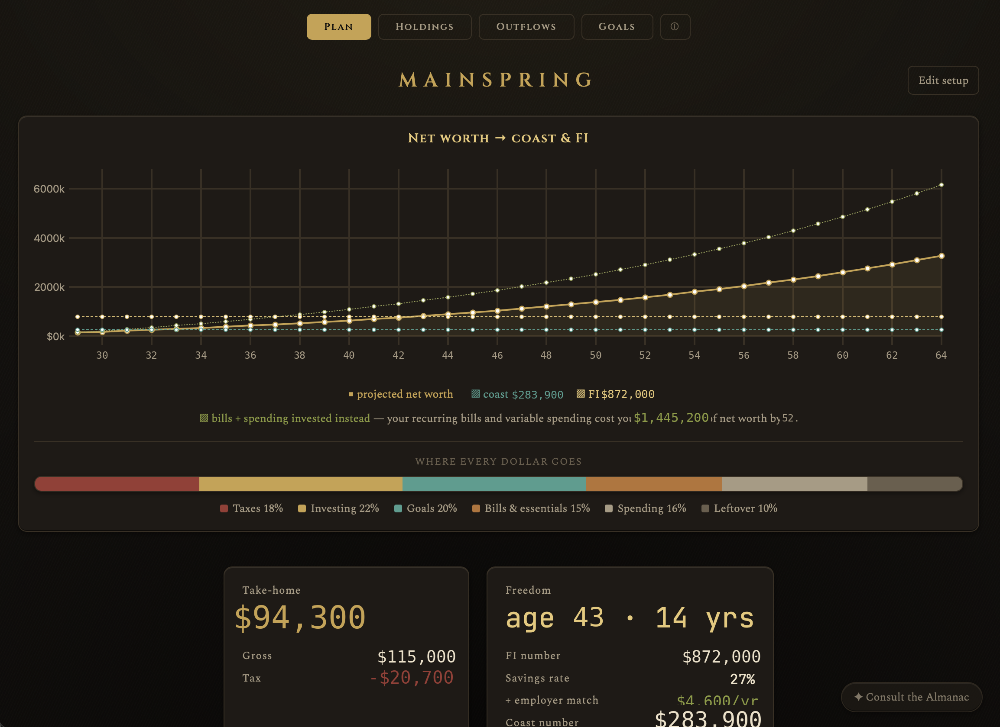
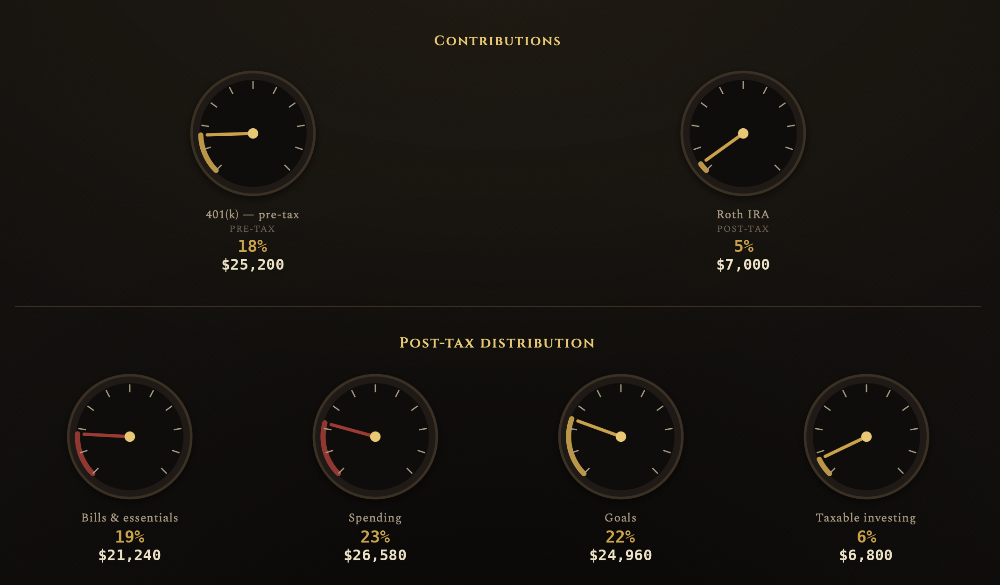
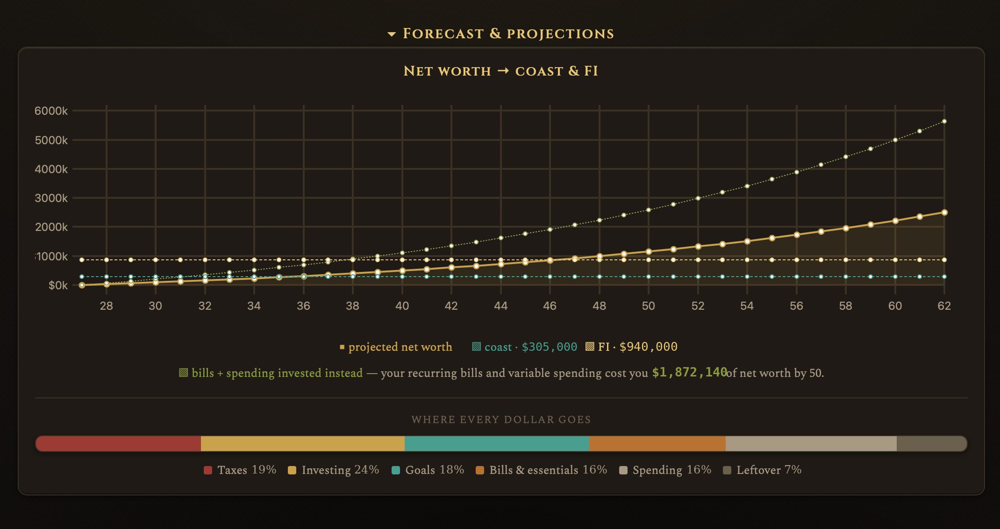
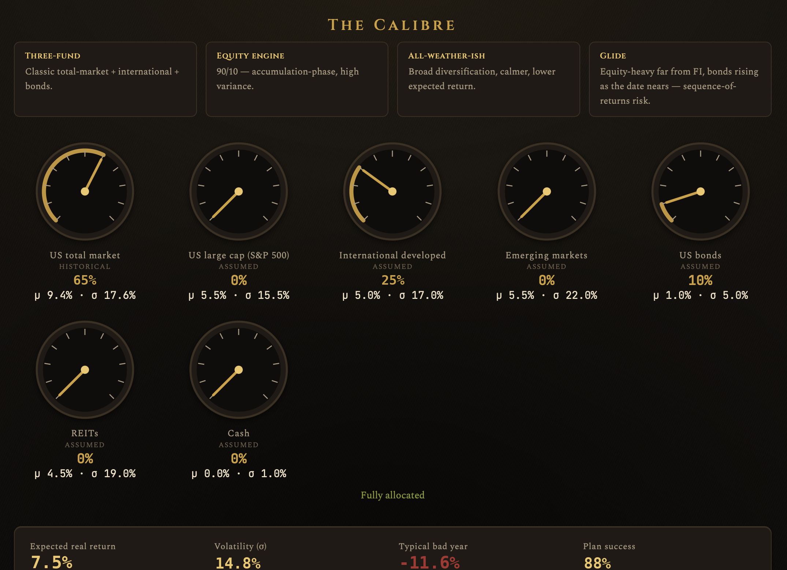
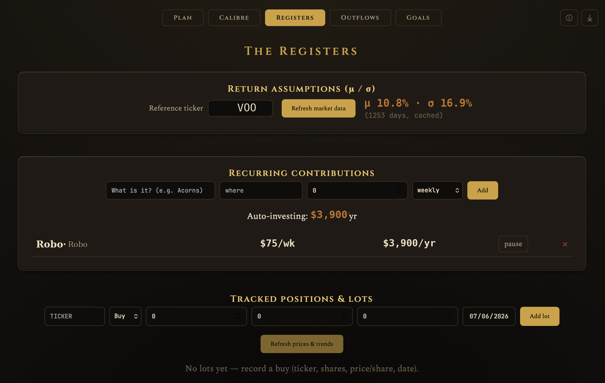
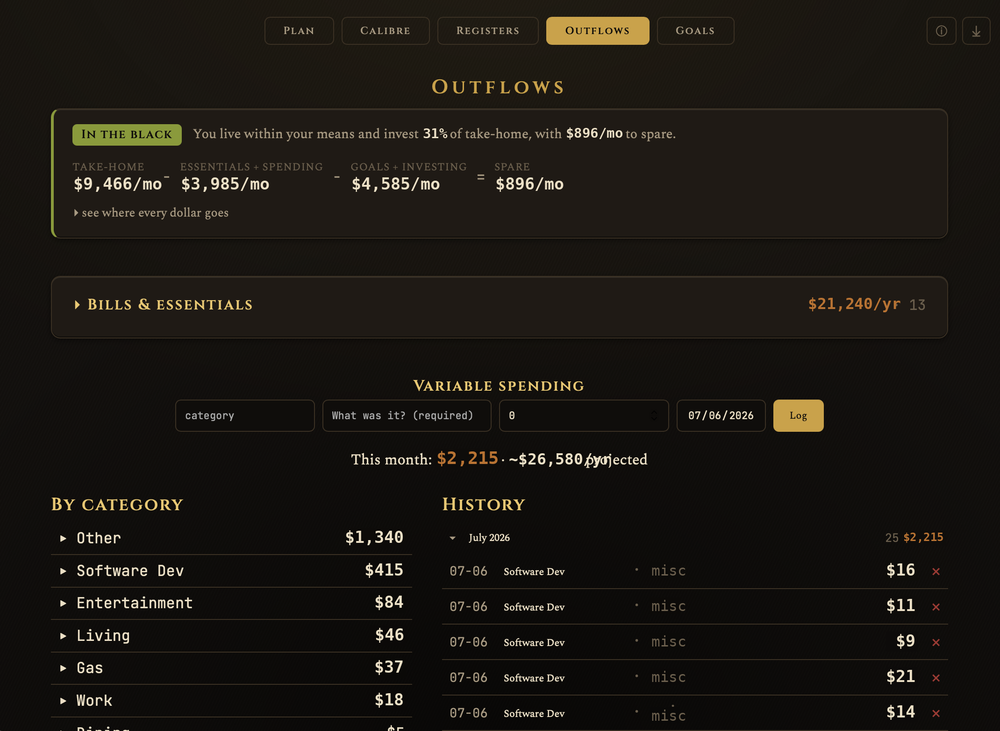
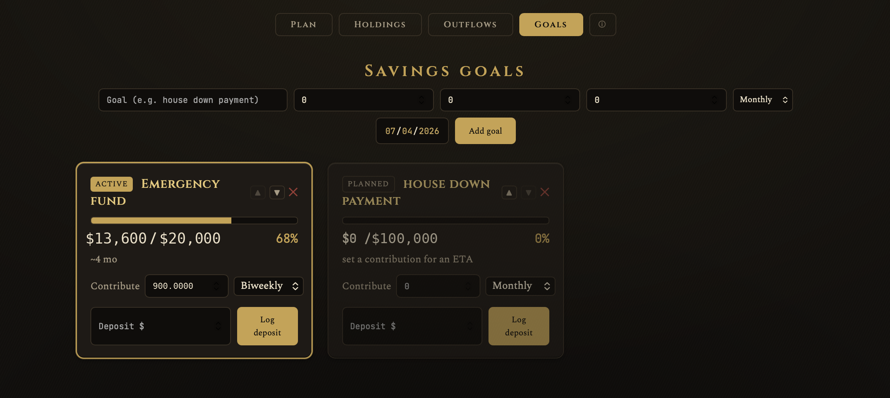
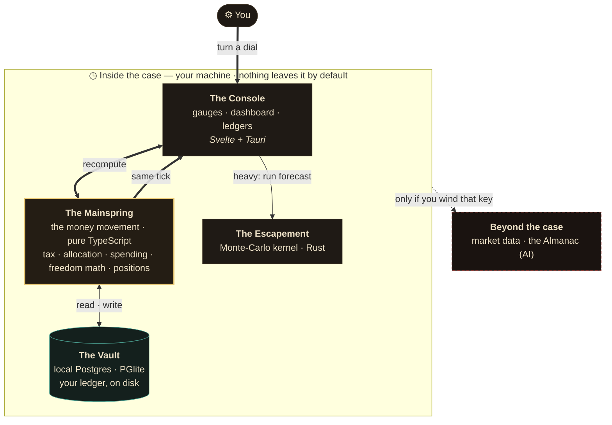
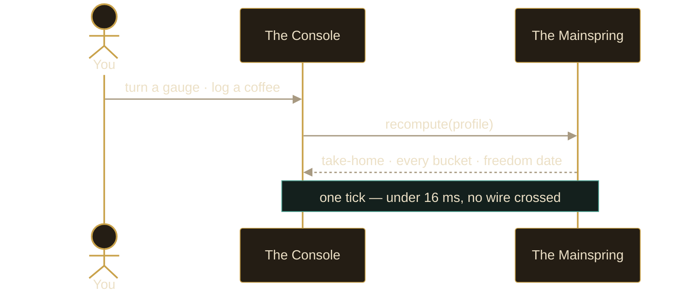

# MAINSPRING

[](https://github.com/skazler/mainspring/actions/workflows/ci.yml)

> A private, offline-first planner for **financial independence**.
> Wind it up — and the whole movement turns together.
>
> **MAINSPRING** — the coiled spring at the heart of a mechanical watch: wound once, it releases its energy steadily to drive every hand on the face.

<p align="center">
  <a href="https://github.com/skazler/mainspring-releases/releases/latest"></a>
  <br>
  <sub>Pick the installer for your OS. Unsigned builds — macOS needs a one-time <code>xattr -cr</code> unlock (<a href="#macos--unsigned-one-time-unlock">see below</a>); Windows: SmartScreen → Run anyway.</sub>
</p>

Single-user. Local-first. Privacy-critical — this holds your real money, so by default nothing leaves a machine you control. The instrument is built around **dials**: turn a percentage and watch your take-home, every allocation barrel, and your projected **freedom date** move on the same tick. On the portfolio side, the **Calibre** lets you design an asset-class mix and watch expected return, risk, and success probability respond live, while the **Registers** show how the holdings you actually own have drifted from that design — and what closing the gap costs. Throughout, it's a modeling instrument that explains trade-offs, never a "you should."

## The face

### The Plan — your whole position on one tick

Turn any dial and the vitals, the forecast, and your freedom date all move together — no wire, no server, under one tick.

<p align="center">
  <br>
  <sub><b>Vitals.</b> Take-home (gross minus tax) beside the freedom readout — FI age, FI number, savings rate, employer match, coast number — over a progress-to-freedom meter that runs from where you stand now, through your coast point, to full independence. · <i>Figures redacted; values AI-generated.</i></sub>
</p>

<p align="center">
  <br>
  <sub><b>The levers.</b> Brass contribution dials tagged pre-tax / post-tax (401(k), Roth…), and the post-tax distribution of every take-home dollar across bills, spending, goals, and taxable investing. · <i>Figures redacted; values AI-generated.</i></sub>
</p>

<p align="center">
  <br>
  <sub><b>The forecast.</b> Projected net worth against your coast and FI lines, the opportunity cost of everything spent rather than invested (<i>“bills + spending invested instead”</i>), and a where-every-dollar-goes bar — over a Monte-Carlo success run when you expand it. · <i>Figures redacted; values AI-generated.</i></sub>
</p>

### The Calibre — design the portfolio, watch the odds move

<p align="center">
  <br>
  <sub><b>The Calibre.</b> Design an asset-class <i>mix</i>, not a stock pick. Turn the class gauges — each badged <i>historical</i> or <i>assumed</i> with its own μ/σ — and watch expected real return, volatility, a typical bad year, and plan-success probability respond live at the foot. The chosen calibre becomes the return assumption behind the Plan's forecast. A modeling instrument, not advice. · <i>Figures redacted; values AI-generated.</i></sub>
</p>

### The Registers — track what you actually hold, against the design

<p align="center">
  <br>
  <sub><b>The Registers.</b> Your holdings regrouped by asset class and read against the mix you designed in the Calibre — held-vs-target bars with <b>drift</b> flagged in percentage points, and off-plan or unassigned holdings called out. Each drifted class gets the cheaper fix: a no-sell contribution path for underweights, or a to-the-cent capital-gains cost to trim an overweight. A one-time picker maps each ticker to a class; elsewhere on the tab a reference ticker sets the forecast's μ/σ and recurring auto-contributions feed the projection. Modeled from your lots, cached prices, and tax profile — not tax advice. · <i>Figures redacted; values AI-generated.</i></sub>
</p>

### Outflows &amp; Goals — what leaves, and what you're building toward

<p align="center">
  <br>
  <sub><b>Outflows.</b> A cash-flow verdict — in the black or over budget — from take-home minus essentials, spending, goals, and investing. Bills roll up by category; variable spending is logged, projected to an annual run-rate, and grouped by month. · <i>Figures redacted; values AI-generated.</i></sub>
</p>

<p align="center">
  <br>
  <sub><b>Goals.</b> Sinking funds as an ordered checklist — one funds at a time (active vs. planned), at any cadence, each with progress, ETA, and a deposit log. · <i>Figures redacted; values AI-generated.</i></sub>
</p>

---

## The instrument

A desktop movement (Tauri) in which the entire money model — tax, allocations, projections — is a single shared TypeScript engine that runs on-device the instant you touch a dial, kept in a local Postgres-compatible vault, with a Rust kernel for the one heavy calculation: Monte-Carlo forecasting. No server. No round-trip to move a hand.

## How the movement turns

Everything sits inside the case, on your machine. A **pure TypeScript engine — the Mainspring** does all the money math *in the app*, so the dials answer instantly. A **Rust escapement** regulates the one heavy job (Monte-Carlo). A **local Postgres vault (PGlite)** keeps your ledger on disk. Only two things reach beyond the case, and only if you wind that key: fetching market prices, and consulting the Almanac (the optional AI).



**The core loop is a straight line — no wire, no server, the same tick:**



**Why the movement is cut this way:** the Mainspring is a *pure, framework-free* package — no UI, DB, or network in its gears. It is the durable asset. The Console (Svelte), the case (Tauri), the Vault (PGlite), and the Escapement (Rust) are all replaceable jewels set around it. Deep dives: [`ARCHITECTURE.md`](./docs/ARCHITECTURE.md) (as-built diagrams) · [`SCHEMA.md`](./docs/SCHEMA.md) (every table).

## The parts list

**Fitted** — every row is a real dependency or in-repo code:

| Component | Made of |
|---|---|
| Case & crown | Tauri 2 (Rust) — native, tiny, private |
| Face & dials | Svelte 5 (runes) + TypeScript + Vite |
| The Mainspring | **isomorphic TypeScript engine** — one source of truth for tax, allocation, projection |
| The Escapement | Rust Monte-Carlo kernel (`crates/sim`) → native (desktop) |
| The Vault | PGlite (Postgres in-process) — local, on disk |
| Engraving & fitting | Drizzle (migrations) · Zod (validation) |
| Charts & sub-dials | uPlot |
| Finish | a hand-rolled steampunk token layer (`tokens.css`) — no CSS framework |
| Market data | the Yahoo Finance v8 chart endpoint (free, opt-in; not the `yfinance` Python lib) |
| Key custody | the OS keychain (macOS Keychain / Windows Credential Manager / Linux secret-service) |
| The Almanac (optional) | planning assistant — Q&A + plain-English → validated dial changes, via your own Anthropic key |

**On the bench** — designed for, not yet fitted:

| Component | Status |
|---|---|
| DuckDB (analytics) | not a dependency yet |
| Finnhub live quotes | aspiration (needs a key) |
| ElectricSQL sync → self-hosted Postgres | scaffold only (`infra/sync`) |
| Observable Plot | not used — charts are uPlot only |

## Maker's notes (for the agents who build it)

| File | For the hand fitting… |
|---|---|
| [`ARCHITECTURE.md`](./docs/ARCHITECTURE.md) | system overview, diagrams, full stack, scaling & longevity, repo layout |
| [`DOMAIN_MODEL.md`](./docs/DOMAIN_MODEL.md) | entities, ER diagram, money-handling rules |
| [`SCHEMA.md`](./docs/SCHEMA.md) | full backend schema reference — every table + column |
| [`MONEY_ENGINE.md`](./docs/MONEY_ENGINE.md) | the isomorphic TS core: cashflow + tax + allocation |
| [`STOCK_MANAGEMENT.md`](./docs/STOCK_MANAGEMENT.md) | positions as a lot ledger, valuation, capital-gains tax |
| [`PREDICTION_ENGINE.md`](./docs/PREDICTION_ENGINE.md) | deterministic + Monte-Carlo + freedom metrics + Rust kernel + optional ML |
| [`DATA_LAYER.md`](./docs/DATA_LAYER.md) | PGlite + DuckDB, persistence, market data, optional sync |
| [`FRONTEND.md`](./docs/FRONTEND.md) | Svelte 5 + Tauri, the dial component, live recompute |
| [`DESIGN_SYSTEM.md`](./docs/DESIGN_SYSTEM.md) | steampunk design tokens, gauges, type |
| [`AI_WORKFLOWS.md`](./docs/AI_WORKFLOWS.md) | how to build it *with* agents + the optional in-app AI |
| [`BUILD_PLAN.md`](./docs/BUILD_PLAN.md) | phased milestones with acceptance criteria |
| [`TESTING.md`](./docs/TESTING.md) | golden + property + E2E strategy |
| [`COSTS.md`](./docs/COSTS.md) | running-cost breakdown ($0 local) |

## Winding it up

```bash
pnpm install
pnpm tauri dev        # opens the movement (local PGlite vault)
pnpm test             # vitest (schema + engine + app)
cargo test --workspace # Rust kernel + market parser
pnpm lint && pnpm typecheck
pnpm --filter desktop tauri build   # packaged MAINSPRING.app
```

First run shows a **setup page** (income, taxes, contributions); it's kept locally and the dial console follows.

## Taking one home

Packaged installers for macOS, Windows, and Linux live in the downloads repo, **[skazler/mainspring-releases](https://github.com/skazler/mainspring-releases/releases/latest)** — not here. Keeping binaries out of the source repo means a release is a publish step rather than a commit, and someone who only wants the app never has to clone this. (GitHub "Packages" is for npm/Docker registries, not app binaries.)

To cut a release: land a `chore:` commit bumping the version in the five places that carry it (`package.json`, `apps/desktop/package.json`, `apps/desktop/src-tauri/Cargo.toml`, `apps/desktop/src-tauri/tauri.conf.json`, `Cargo.lock` — `cargo update -p desktop --offline` handles the last), then push the matching tag from `main`:

```bash
git tag v1.3.1 && git push origin v1.3.1   # → draft release in mainspring-releases; publish it to share
```

The [release workflow](./.github/workflows/release.yml) builds all three platforms and attaches every installer to a single **draft** release in the downloads repo. It re-stamps `tauri.conf.json` from the tag, so installer filenames always match the release even if the bump commit is missed — but the other four files are the repo's source of truth and won't fix themselves. Each build job uploads straight onto the draft rather than passing installers through Actions artifacts, so the account-wide artifact quota can't fail a release; re-running a partially-failed one is safe, since the draft is reused and assets are replaced rather than duplicated.

Expect ~15 minutes for the matrix. The draft's URL carries a placeholder slug until you publish it, at which point it becomes the clean `/releases/tag/v1.3.1`.

Publishing the draft is the last manual step: the downloads repo rewrites its own README from the release's actual assets on `release: published`, so the direct download links there never need touching by hand.

### macOS — unsigned, one-time unlock
There's no Apple Developer cert yet, so macOS quarantines the download and may claim **"MAINSPRING is damaged and can't be opened."** It isn't damaged — that's just Gatekeeper on an unsigned app. Drag it to **/Applications**, then run once in Terminal:

```bash
xattr -cr /Applications/MAINSPRING.app
```

Open it normally afterward. (If it still refuses, ad-hoc sign it once: `codesign --force --deep --sign - /Applications/MAINSPRING.app`.) Windows shows a SmartScreen prompt — **More info → Run anyway**. Proper signing/notarization removes both, and the [release workflow](./.github/workflows/release.yml) documents the secrets to wire in.

## What's ticking

Phases 0–8 of [`BUILD_PLAN.md`](./docs/BUILD_PLAN.md) are fitted, plus the optional AI assistant (the Almanac).

| Area | State |
|---|---|
| Workspace + Tauri/Svelte 5 app, CI | ✅ |
| Schema + `Money` (decimal.js) + PGlite | ✅ |
| Tax engine (federal + FICA + TX, 2026) | ✅ golden-tested |
| Positions + capital gains (lots, FIFO/spec-ID, NIIT) | ✅ engine + lot-ledger UI (normalized `lots` table) |
| **The Calibre** — asset-class mix design (live μ/σ + success) | ✅ portfolio math (golden + property-tested); feeds the Plan's forecast |
| **The Registers** — holdings by class, drift, tax-costed rebalance | ✅ engine (golden-tested) + drift UI; taxable-account trim cost |
| Cashflow + allocation + `recompute` | ✅ property-tested |
| Deterministic projection + steampunk gauges | ✅ |
| Monte-Carlo kernel (Rust) + fan chart | ✅ |
| Market data (yfinance → PGlite, μ/σ) | ✅ |
| Setup/onboarding + persistence + local backup/restore | ✅ |
| Scenarios (save/load/compare) | ✅ |
| Stock trend estimations (per-holding fan chart) | ✅ |
| Theme polish + packaged `.app` build | ✅ |
| The Almanac — plan Q&A + plain-English → validated dial changes | ✅ (bring your own Anthropic key) |
| Multi-device sync (ElectricSQL) | scaffold only — [`infra/sync`](./infra/sync) |

Follow-ups on the bench: macOS code-signing (needs an Apple Developer cert), Finnhub live quotes (needs a key), full *relational* profile persistence (the profile is a jsonb snapshot today; positions are normalized), and end-to-end sync wiring.

## The three rules of the escapement

1. **Money is never a float.** `Decimal` end-to-end, exact in the vault.
2. **The Mainspring is pure and framework-free** — it outlives any face, vault, or case it's set in.
3. **Your ledger stays local by default.** Nothing is sent beyond the case without an explicit turn of the key.
