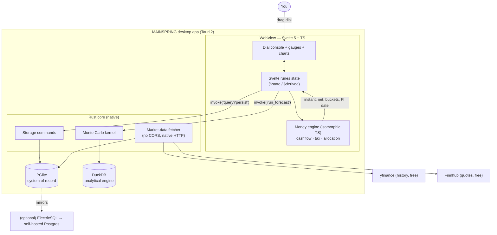
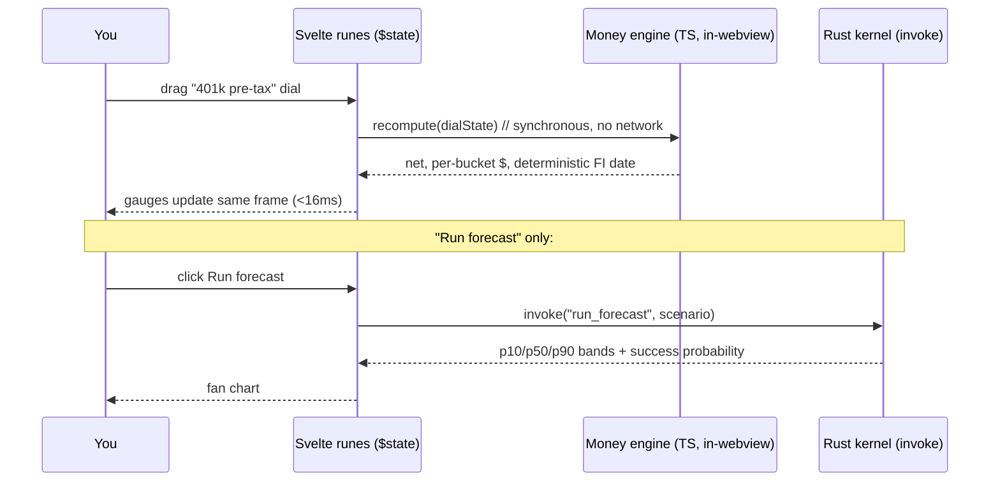
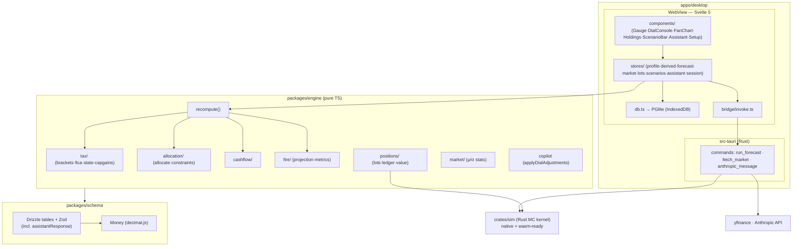
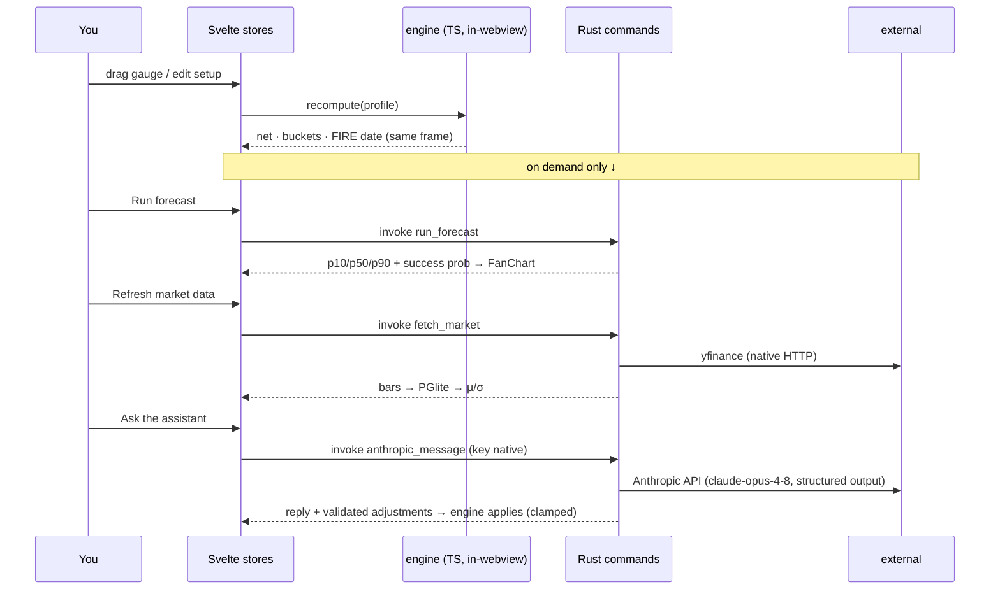

# MAINSPRING — Architecture

System overview, the stack and why, how it scales over decades, and the repo layout. This is the orientation doc; deep specs live in the sibling files.

---

## 1. Principles

1. **Local-first, single-tenant.** Your data lives on a machine you control. The dial loop has no network in its hot path. Cloud/sync is an explicit opt-in, never the default.
2. **One money model, written once.** Tax, allocation, and projection logic is a pure **isomorphic TypeScript** package. It runs in the UI for instant feedback and could run anywhere else unchanged. No logic is ever duplicated between "client" and "server."
3. **Native speed where it counts.** The Monte Carlo kernel is Rust — invoked natively on desktop, compiled to WASM for any web build. Same crate, two targets.
4. **The engine outlives the app.** UI frameworks, databases, and shells are replaceable. The pure engine (money + projection contracts) is the asset; everything else is wiring. This is the core longevity bet (see §6).
5. **Deterministic core, probabilistic forecast.** Closed-form compounding for "what's my number"; Monte Carlo for "how sure am I."
6. **Agent-executable.** Typed contracts (Zod + Drizzle + Rust types), focused per-module docs, milestones with acceptance tests. An agent should finish a milestone without guessing. See [`AI_WORKFLOWS.md`](./AI_WORKFLOWS.md).

---

## 2. System overview



The TypeScript engine handles every dial recompute **in the webview, synchronously** — there is no network and no IPC in the drag path, so it's frame-rate instant. Only heavy work crosses into Rust: Monte Carlo (`invoke('run_forecast')`), market-data fetches, and persistence. On a pure-web build the same pieces map to WASM (kernel) and PGlite/DuckDB-WASM (storage) in the browser.

---

## 3. The stack, and why each piece

| Layer | Choice | Why this, looking forward |
|---|---|---|
| **Shell** | Tauri 2 | Native desktop, ~MBs not ~100s of MBs (vs Electron), Rust backend for native HTTP + storage + the sim kernel. A genuinely private local app. Same Svelte code can also ship as a plain website. |
| **UI** | Svelte 5 (runes) | `$state`/`$derived` model is almost literally "dial → derived take-home → derived FI date." Tiny compiled runtime. Less boilerplate than React for a reactive-derived UI. |
| **Language** | TypeScript everywhere (UI + engine) | The money math is written **once** and runs in the webview instantly. Types flow end to end. No Python↔TS duplication, no "thin client estimator that reconciles to a server" hack. |
| **Money engine** | Pure isomorphic TS package (`packages/engine`) | Framework-free, storage-free, I/O-free. Testable in milliseconds. The durable asset. |
| **Decimal** | `dinero.js` (or `decimal.js`) | Exact money. Never float. |
| **Sim kernel** | Rust (`crates/sim`) | Vectorized Monte Carlo at native speed on desktop; the *same crate* compiles to WASM for web. 100k+ paths stay sub-second. |
| **System of record** | PGlite (Postgres in-process) | It *is* Postgres — so the local schema equals any future cloud schema, migration is trivial, and you get extensions (incl. `pgvector` for optional local AI). |
| **Analytics** | DuckDB | Columnar speed for market-history rollups + Monte Carlo output aggregation. Optional accelerator over PGlite for heavy reads. |
| **ORM / migrations** | Drizzle | One schema definition, works against PGlite locally and Postgres in the cloud. Type-safe, lightweight, codegen-friendly for agents. |
| **Validation** | Zod | Single schema source for engine I/O and persisted blobs; Standard-Schema-compatible. |
| **Charts** | uPlot + Observable Plot | uPlot renders the Monte Carlo fan chart (thousands of points, percentile bands) at 60fps; Observable Plot for everything else. |
| **Styling** | Tailwind v4 + CSS custom-property token layer | Utility speed + a steampunk token system (see [`DESIGN_SYSTEM.md`](./DESIGN_SYSTEM.md)). |
| **Market data** | yfinance (history) + Finnhub (quotes), fetched in Rust | Both free; native fetch sidesteps browser CORS. Cached in PGlite; the simulator reads local, never live-hits an API mid-run. |
| **Sync (optional)** | ElectricSQL → self-hosted Postgres | Only if you want multi-device. Single-user means you **skip CRDT/conflict-resolution entirely** — the hard part of local-first doesn't apply to you. |
| **Build/test** | Vite + pnpm + Vitest + Playwright + `cargo test` | Fast feedback; agent-friendly. |

### Why not the heavier options
- **No always-on backend service.** Tauri's Rust core + a local DB is the backend. Nothing to host, nothing to pay for, nothing to leak.
- **No sync engine by default.** You're one user. Sync is opt-in and only for multi-device.
- **No Python in the hot path.** Optional, offline, only if you build the ML expense forecaster (see [`PREDICTION_ENGINE.md`](./PREDICTION_ENGINE.md) §ML).

---

## 4. Where the money math runs (the key decision)



Because the engine is in-process TS, the dial is instant and there is exactly **one** implementation of tax/allocation. Heavy probabilistic work is the only thing that crosses to Rust.

---

## 5. Deployment

| Mode | What runs | Cost |
|---|---|---|
| **Desktop (primary)** | Tauri app, local PGlite + DuckDB, all on your machine | **$0** |
| **Multi-device (optional)** | + ElectricSQL syncing to a self-hosted Postgres on one Hetzner CX22 | **~€4–5/mo** |
| **Web build (optional)** | Same Svelte + TS engine, storage via PGlite/DuckDB-WASM, kernel via WASM, hosted on Cloudflare Pages | **~$0** |

See [`COSTS.md`](./COSTS.md) for the full breakdown.

---

## 6. Will it scale over the long run?

Honest answer: yes — but "scale" means three different things here, so take them separately.

**a) Data growth over decades.** A lifetime of transactions, contributions, and daily market bars is *small* — low hundreds of MB, maybe a couple GB with decades of intraday history. PGlite handles that comfortably, and DuckDB chews through analytical scans of it instantly. Local stays fast essentially forever. There is no data-volume cliff for a single household.

**b) Simulation size.** The Rust kernel vectorizes the path matrix; 10k paths × 40 years is single-digit milliseconds, and it scales to 100k+ paths sub-second. If you ever wanted enormous ensembles, the *same crate* runs natively on the desktop (and could run on a server) without a rewrite. Compute is not a long-run constraint.

**c) If you ever productize it (multi-user SaaS).** This is where the architecture is actually *more* future-proof, not less. Because PGlite is real Postgres and Drizzle targets both, the local schema lifts to a hosted Postgres unchanged; the isomorphic engine already runs server-side without modification; and the optional sync layer (ElectricSQL/Zero) is purpose-built for exactly the local-first-multi-tenant pivot. You'd add auth + a hosted Postgres + the sync layer — a known, well-trodden path — without touching the money math. Most architectures make this pivot painful; this one is designed for it.

**The real longevity insurance** is principle §1.4: the engine is a **pure, framework-free, storage-free TypeScript package with typed contracts.** Every churny part of the stack has a clean exit:

| If this stalls… | …the migration is |
|---|---|
| PGlite | trivial — it's Postgres; point Drizzle at server Postgres |
| Svelte 5 | UI rewrite only; the engine and kernel are untouched (they have no framework dependency) |
| Tauri | ship the same Svelte app as a plain website; storage falls back to PGlite-WASM |
| Rust kernel | a TS Monte Carlo implementation is a drop-in (the kernel is just `params → percentiles`) |
| A sync engine | you're single-user; you can drop it with zero data-model change |

The bet is on younger tools (PGlite, Tauri, Svelte 5 runes, sync engines). The mitigation is that none of them touch the part that's expensive to rewrite. The money model is insulated by design.

---

## 7. Repo layout

```
mainspring/
├── README.md
├── docs/                       ← these specs
├── package.json                ← pnpm workspace root
├── packages/
│   ├── engine/                 ← ISOMORPHIC TS: cashflow, tax, allocation, fire-metrics
│   │   ├── src/
│   │   └── tests/              ← golden (tax) + property (allocation/projection)
│   ├── schema/                 ← Zod + Drizzle schema (shared types, system of record)
│   └── ui/                     ← shared Svelte components incl. <Gauge>
├── crates/
│   └── sim/                    ← Rust Monte Carlo kernel (native + wasm targets)
├── apps/
│   └── desktop/                ← Tauri app
│       ├── src/                ← Svelte 5 frontend (routes, stores, charts)
│       ├── src-tauri/          ← Rust: invoke commands (forecast, fetch, persist)
│       └── tauri.conf.json
└── infra/
    └── sync/                   ← (optional) ElectricSQL + Postgres compose for multi-device
```

Bounded contexts map to packages so an agent can own one at a time:

| Context | Lives in | Spec |
|---|---|---|
| Money math (pure) | `packages/engine` | [`MONEY_ENGINE.md`](./MONEY_ENGINE.md) |
| Forecasting | `packages/engine` + `crates/sim` | [`PREDICTION_ENGINE.md`](./PREDICTION_ENGINE.md) |
| Data & persistence | `packages/schema` + `apps/desktop/src-tauri` | [`DATA_LAYER.md`](./DATA_LAYER.md) |
| UI & dials | `apps/desktop/src` + `packages/ui` | [`FRONTEND.md`](./FRONTEND.md) |
| Theme | `packages/ui` | [`DESIGN_SYSTEM.md`](./DESIGN_SYSTEM.md) |

---

## 8. As-built module map

What's actually implemented today (phases 0–8 + the AI assistant). UI components and the steampunk token layer currently live in `apps/desktop/src/lib` rather than a separate `packages/ui` (extraction is a later refactor).



## 9. Implemented runtime flows


