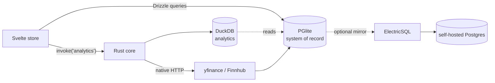

# MAINSPRING — Data Layer

Local-first persistence, the analytical engine, market-data ingestion, and the optional multi-device path.

> **As built vs on the bench (D5).** Fitted today: **PGlite** (the local store) and
> market data via the **Yahoo Finance v8 chart endpoint** (free, no key — not the
> `yfinance` Python library). Designed-for but **not yet fitted**: **DuckDB**
> analytics, **Finnhub**/Twelve Data quotes, and **ElectricSQL** sync (scaffold
> only in `infra/sync`). Read the sections below as the target design, not the
> current wiring.

---

## 1. Two stores, one record

| Store | Role | Why |
|---|---|---|
| **PGlite** | System of record: profile, accounts, holdings, dials, scenarios, forecasts, market bars | It's Postgres in-process — local schema equals any future cloud schema, full SQL, extensions (incl. `pgvector`). Migration to hosted Postgres is a connection-string change. |
| **DuckDB** | Analytical engine: market-history rollups, Monte Carlo output aggregation, plan comparison | Columnar; scans decades of bars and large path matrices instantly. Optional accelerator — skip it if PGlite reads are fast enough at your data size. |

Both run embedded inside the app. On desktop they run natively (via the Tauri Rust core); in a web build they run as PGlite-WASM and DuckDB-WASM in the browser. Same SQL either way.

DuckDB can query PGlite's data directly (or via exported Parquet), so analytics never duplicate the source of truth.

---

## 2. Schema & migrations

Defined once in `packages/schema` with **Drizzle** (see [`DOMAIN_MODEL.md`](./DOMAIN_MODEL.md)). Drizzle generates migrations that apply to PGlite locally and to Postgres in the cloud unchanged. Money columns are `NUMERIC(18,4)`.

---

## 3. Market data (free)

Fetched by the **Rust core** (native HTTP — no browser CORS), cached in PGlite, then read locally by the simulator. The simulator never live-hits an API mid-forecast.

| Need | Source | Free terms (verified Jun 2026) | Notes |
|---|---|---|---|
| Long daily history (Monte Carlo bootstrap, backtests) | **yfinance** | free, no key, 20+ yrs, total-return capable | unofficial Yahoo scrape — cache aggressively, treat as best-effort |
| Current quotes for holdings | **Finnhub** | ~60 calls/min free, free WebSocket | official, keyed; used only when the holdings view is open |
| Fallback | **Twelve Data** | ~800 calls/day free | optional secondary if yfinance flakes |

Pull history once into `market_bars`, refresh on a schedule. **Total market-data cost: $0.** Re-verify free-tier terms before launch; yfinance being unofficial is the real risk, and the local cache is the insulation.

---

## 4. Optional: multi-device sync

Only if you want the planner on more than one machine. Because you're a single user, you **skip CRDTs and conflict resolution entirely** — there are no concurrent multi-user edits to reconcile.

- **ElectricSQL** streams your self-hosted Postgres → local PGlite (read sync via "shapes"); writes go up through a thin path. One Hetzner CX22 (~€4–5/mo) hosts the Postgres mirror.
- Everything still works fully offline; sync is background reconciliation.
- This layer is the youngest part of the stack — which is exactly why it's opt-in and isolated. Drop it and nothing about the data model changes.

See [`COSTS.md`](./COSTS.md).
