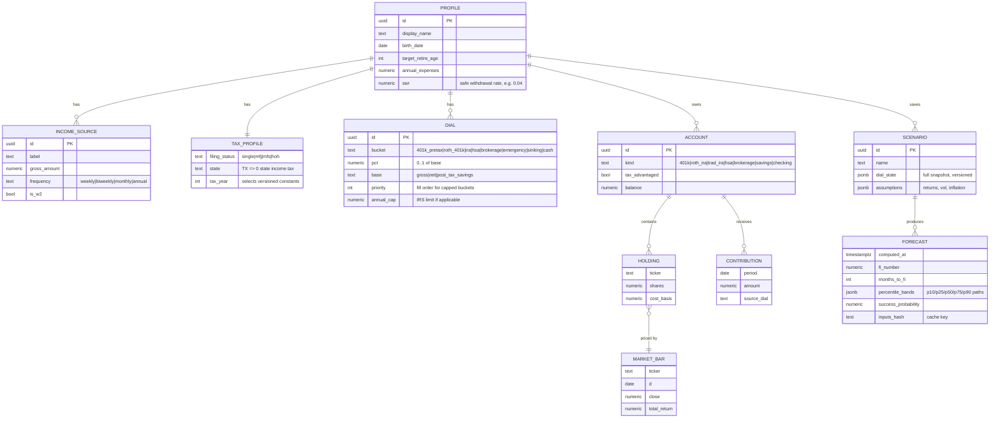

# MAINSPRING — Domain Model

The entities, their relationships, and the money-handling rules. Schema is defined once with Drizzle (tables) + Zod (validation) in `packages/schema` and consumed by both the engine and the UI.

---

## 1. Entity relationships



---

## 2. Money handling (non-negotiable)

- **DB columns:** Postgres `NUMERIC(18,4)` (PGlite is Postgres, so this holds locally too).
- **In TS:** a `Money` value object backed by `dinero.js` (integer minor units) — never the JS `number` type for currency. A lint rule + a branded type forbid constructing `Money` from a float.
- **Percentages (dial positions):** fixed-precision decimals in `[0, 1]`.
- **Rounding:** explicit `HALF_UP`, applied only at display/persist boundaries — never mid-calculation.
- **Serialization:** money crosses the TS↔Rust boundary (to the sim kernel) as integer minor units or scaled fixed-point, not floats, to keep the kernel deterministic.

## 3. Schema source of truth

```
packages/schema/
  tables.ts        # Drizzle table defs  → migrations (PGlite + Postgres)
  zod.ts           # Zod schemas         → engine I/O + API/IPC validation
  index.ts         # inferred TS types re-exported to engine + UI
```

One definition produces: the migration, the runtime validator, and the static types. Agents import from `@mainspring/schema` everywhere; there is no second place a field can drift.

## 4. Scenario versioning

`SCENARIO.dial_state` and `assumptions` are stored as JSONB with an explicit `schema_version`. When the dial schema evolves, a small migrator upgrades old blobs on read, so a plan you saved years ago still loads. `FORECAST.inputs_hash` keys cached Monte Carlo results so an unchanged scenario never re-runs 10k paths.
