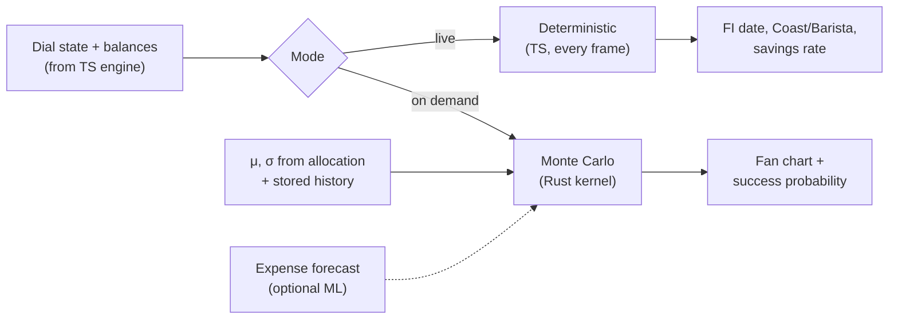

# MAINSPRING — Prediction Engine

Three layers. Deterministic compounding (instant, in the TS engine) and Monte Carlo (the Rust kernel) are the workhorses. ML is a clearly fenced, optional later phase.

---

## 1. Deterministic projection (instant view)

Year-by-year compounding, run inside the TS money engine on every dial change. Powers the live "you reach freedom in 2041" readout.

```
balance[t] = balance[t-1] * (1 + rReal) + annualContribution
```

`rReal` is the assumed real (inflation-adjusted) return for the current asset mix. Cheap enough to run every frame. Feeds the FIRE metrics in [`MONEY_ENGINE.md`](./MONEY_ENGINE.md) §5.

---

## 2. Monte Carlo (confidence view) — the Rust kernel

Markets are not a constant return. This produces a *distribution* of outcomes and a success probability. It is the one genuinely CPU-bound job, so it lives in Rust.

### Why Rust, and the two-target trick
`crates/sim` compiles to **two targets from one source**:
- **native** — invoked on desktop via Tauri `invoke("run_forecast", …)`, no WASM overhead, full speed.
- **wasm** — via `wasm-bindgen`, for any browser build, called from the same TS interface.

The TS side sees one function: `runForecast(scenario) -> { bands, successProbability }`. It doesn't know or care which target served it.

### Two interchangeable models

**(a) Geometric Brownian Motion (parametric).** Per path, per step:
```
S[t+1] = S[t] * exp( (μ − σ²/2)·Δt  +  σ·√Δt · Z ),   Z ~ N(0,1)
```
μ, σ derived from the asset allocation (stock/bond mix) by the data layer.

**(b) Historical bootstrap (non-parametric).** Resample actual annual real returns from stored history (S&P 500 + bond blend, decades deep). Block-bootstrap (multi-year blocks) preserves some sequence structure and captures fat tails GBM misses.

### Vectorized (Rust sketch)
```rust
// shape: n_paths x n_years; accumulate contributions, then percentiles
pub fn simulate(p: &SimParams) -> Forecast {
    let mut paths = Array2::<f64>::zeros((p.n_paths, p.n_years));
    // fill annual growth factors from GBM or bootstrap, fold in
    // contributions during accumulation and withdrawals during decumulation,
    // then take p10/p25/p50/p75/p90 across paths per year.
    percentiles(&paths)
}
```
10k paths × 40 years is single-digit ms; the kernel scales to 100k+ sub-second. Seed the RNG so runs are reproducible and cacheable.

### Outputs
- **Percentile bands** (p10/p25/p50/p75/p90) of net worth over time → the fan chart.
- **Success probability** = share of paths that never deplete through the planning horizon.
- **Sequence-of-returns risk.** Paths run *through* the withdrawal phase (decumulate at inflation-adjusted expenses). A bad-returns-early path can fail despite a fine average — the thing simple compounding hides, and the reason this view exists.



---

## 3. Optional: ML expense forecasting (fenced off)

Honest framing: **the prediction that matters for FIRE is the Monte Carlo above, not ML.** But if you want a real model to build, the right target is forecasting *your own spending* from history:

- **Input:** your historical monthly expenses by category.
- **Model:** start simple — seasonal time-series (SARIMAX) or a gradient-boosted regressor on calendar + lag features; Prophet for quick seasonality.
- **Output:** a forward expense curve feeding `annualExpenses` instead of a flat assumption.
- **Where it runs:** training is an occasional **offline** job (Python is fine here — it never enters the app's hot path). Inference ships as an **ONNX** model invoked from Rust/TS, so the running app stays dependency-light and private.
- **Rule:** advisory only. The core forecast must work with a hand-entered expense number. Never let an experimental model become load-bearing for retirement math.

---

## 4. Caching
`FORECAST.inputs_hash` keys results on `(scenario, assumptions)`. If nothing changed, the kernel doesn't re-run. DuckDB stores and aggregates the path outputs for fast re-reads and any "compare two plans" view.
