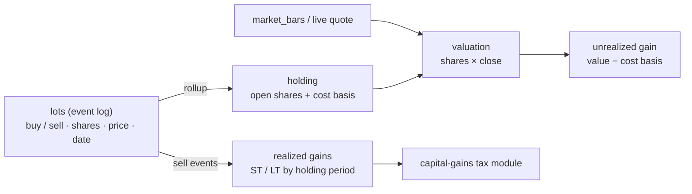

# MAINSPRING — Stock Management

Positions, cost basis, valuation, and capital-gains tax. This concern is **additive**:
the foundations (`Money`, the schema, the tax engine, the market-data layer) already
anticipate it. Nothing here reworks them — it adds one event table, a few pure
valuation functions, and one new tax module that composes into the existing engine.

---

## 1. Principle: positions are an event log

A holding is not a stored balance — it's the **rollup of its lots**. Buys and sells are
immutable events; current shares, cost basis, and realized gains are *derived*. This is
the same events→derived-state pattern the `scenarios` blobs use, and it's what makes
proper tax-lot accounting possible.



`holdings` may still be persisted as a convenience snapshot, but `lots` is the source of
truth; a holding can always be reconstructed from its lots.

---

## 2. Schema additions (`packages/schema`)

One new table. Money stays `NUMERIC(18,4)` via the existing `money` custom type; shares
reuse `NUMERIC(18,6)`.

```
lots
  id            uuid PK
  account_id    uuid FK → accounts
  ticker        text
  side          text        buy | sell
  trade_date    date
  shares        numeric(18,6)
  price         money        per-share execution price
  fee           money        default 0
  closes_lot_id uuid NULL    a sell references the buy-lot it disposes (specific-ID)
```

- A **buy** opens a lot. A **sell** disposes shares against one or more open buy-lots,
  selected by the chosen tax-lot method (see §4).
- `holdings.cost_basis` and `holdings.shares` become **derived** from open lots; keep the
  columns as a cached snapshot if convenient, recomputed on lot change.
- Dividends are **not** lots — they're income (see §6).

---

## 3. Valuation (pure engine, `packages/engine`)

Framework-free, exact, instant — same contract as the rest of the engine.

```ts
positionValue(shares: Decimal, price: Money): Money        // shares × price
unrealizedGain(value: Money, costBasis: Money): Money      // value − costBasis
costBasis(openLots: Lot[]): Money                          // Σ (shares × price + fee)
```

Live price comes from `market_bars` (latest close) or a Finnhub quote when the holdings
view is open — the engine takes the price as an input, it never fetches (preserves purity).

---

## 4. Cost basis & realized gains

On a **sell**, shares are matched to open buy-lots by a **tax-lot method**:

| Method | Rule | Use |
|---|---|---|
| **FIFO** | oldest lots first | default |
| **Specific-ID** | seller names the lot (`closes_lot_id`) | tax optimization |

Each disposed lot yields a realized gain `proceeds − basis`, classified **short-term**
(held ≤ 1 year, taxed as ordinary income) or **long-term** (held > 1 year, preferential
rates). The holding period is `sell.trade_date − buy.trade_date`. Output:

```ts
interface RealizedGains { shortTerm: Money; longTerm: Money }
realizeSale(sale: Lot, openLots: Lot[], method: LotMethod): { realized: RealizedGains; remaining: Lot[] }
```

All pure, golden-testable to the cent.

---

## 5. Capital-gains tax module (extends the tax engine)

The one genuinely new tax concept — and it slots into the existing pattern (`engine/tax`,
versioned `constants/<year>.ts`, composed by `computeTax`).

- **Short-term gains** are taxed as **ordinary income** — they stack onto wages in the
  existing bracket pass; no new code beyond adding them to taxable income.
- **Long-term gains + qualified dividends** use their own **0 / 15 / 20%** brackets,
  **stacked above** ordinary taxable income (which bracket a LT dollar lands in depends on
  total income). So the module takes ordinary `taxableIncome` (already computed) + LT gains.
- **NIIT**: an extra **3.8%** on net investment income over a statutory (non-indexed) MAGI
  threshold ($200k single / $250k MFJ).

```ts
// engine/tax/capgains.ts
computeCapitalGainsTax(input: {
  ordinaryTaxableIncome: Money;   // from computeTax — sets the LT stacking point
  longTermGains: Money;           // LT realized + qualified dividends
  filingStatus: FilingStatus;
  year: number;                   // selects LT brackets + NIIT threshold
}): { longTermTax: Money; niit: Money; total: Money }
```

`computeTax` composes it: ST gains fold into ordinary income; `longTermTax + niit` add to
the total alongside federal/FICA/state. New versioned constants per year: LT brackets and
the NIIT threshold (⚠️ VERIFY against IRS, same discipline as the income brackets).

---

## 6. Dividends

A dividend is **income**, not a position event — model it as an `income_source` (or a
dedicated `dividends` ledger) with a **qualified** flag:

- **Qualified** dividends → taxed at the **LT capital-gains** rates (join `longTermGains`).
- **Ordinary** (non-qualified) → ordinary income.

Reinvested dividends (DRIP) are a dividend **plus** a buy-lot at the reinvest price.

---

## 7. Where each piece lands

| Stock concern | Layer | Status |
|---|---|---|
| Current positions | `holdings` (schema) | exists |
| Buy/sell history, cost basis | new `lots` table | **add** |
| Valuation, unrealized gain | pure engine fns | **add** (small) |
| Realized gains, FIFO/spec-ID | pure engine fns | **add** |
| Capital-gains + NIIT tax | `engine/tax/capgains.ts` + constants | **add** (one module) |
| Dividends (qualified/ordinary) | income + tax | **add** (small) |
| Prices (history + live) | `market_bars` + Finnhub | Phase 6 |
| Rebalancing / target mix | allocation engine | later |
| Per-asset Monte Carlo | Rust kernel (asset-class μ/σ) | Phase 5/6 |

No change to `Money`, the schema foundations, or the engine's purity contract. The bet
that "the engine outlives the app" holds: this is all pure functions and one table.

---

## 8. Build phase

See **Phase 2.5** in [`BUILD_PLAN.md`](./BUILD_PLAN.md). It depends on the tax engine
(Phase 2, done) and the `lots` schema (extends Phase 1); **live** valuation completes once
market data lands (Phase 6), but cost basis, realized gains, and capital-gains tax are all
testable to the cent before then with prices passed in.
